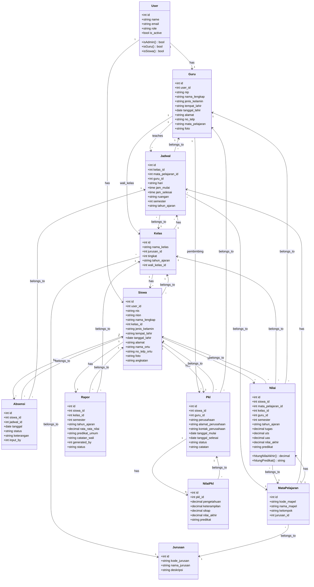
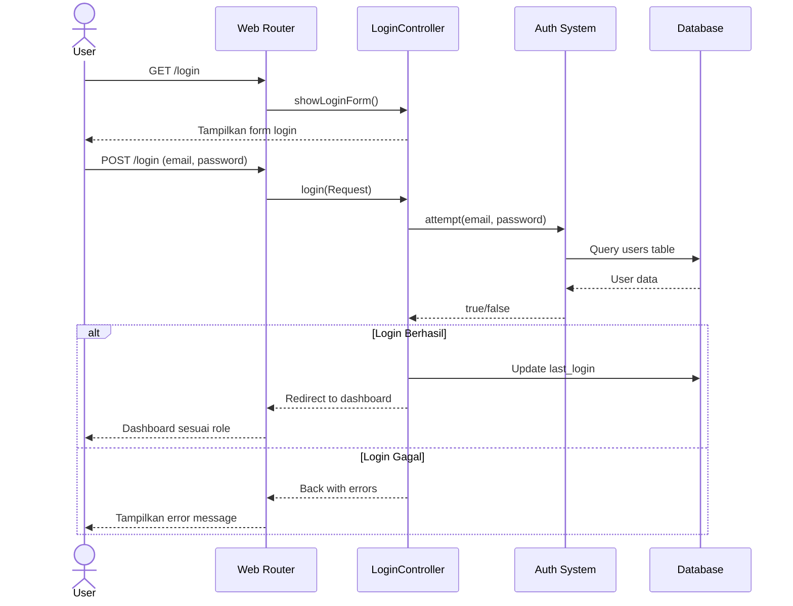
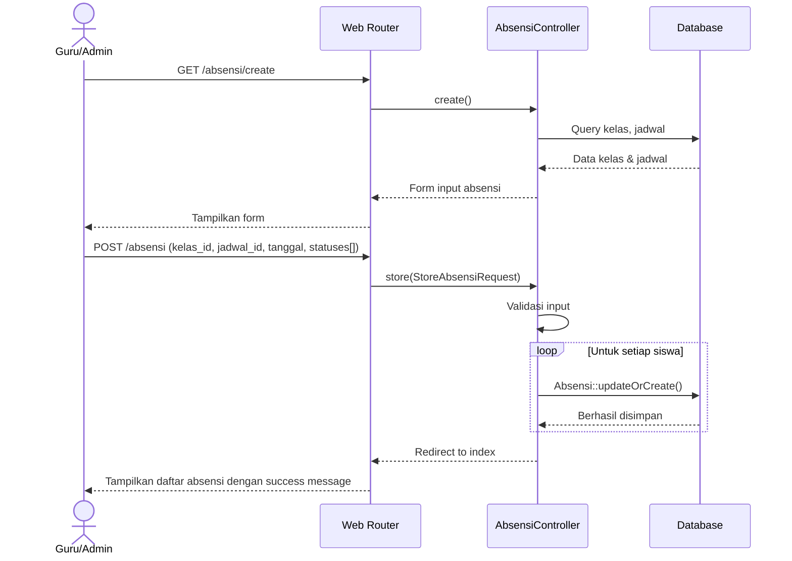
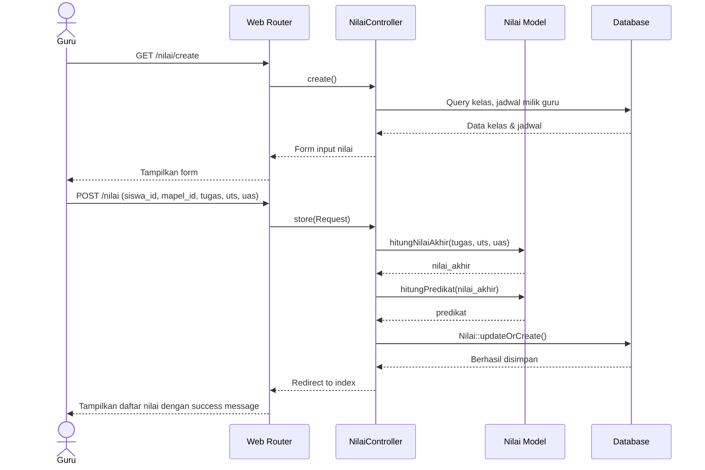
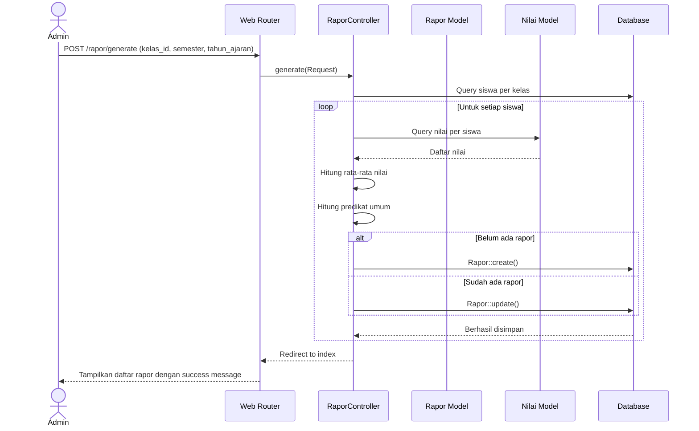
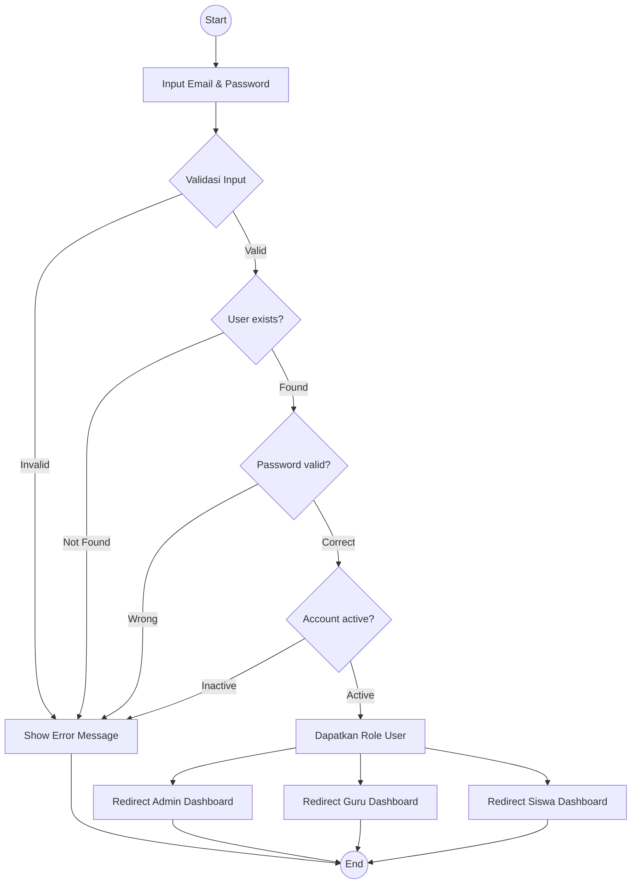
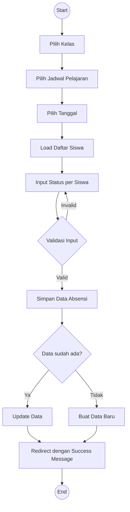
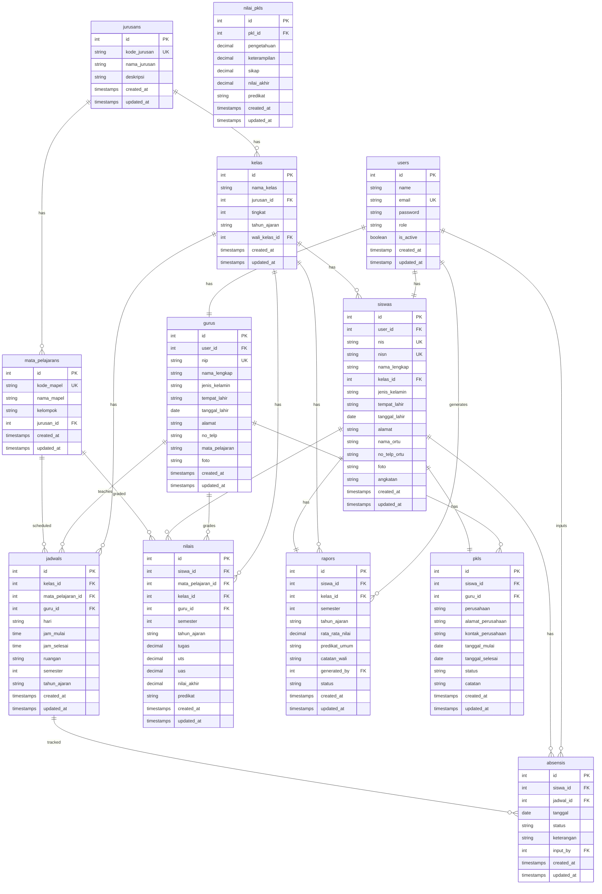
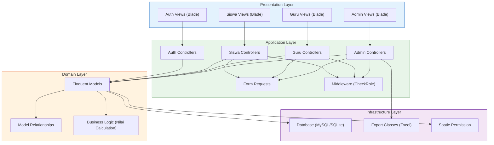

# UML Documentation - Sistem Akademik SMK

Dokumentasi UML lengkap untuk Sistem Akademik SMK.

---

## Table of Contents

1. [Use Case Diagram](#use-case-diagram)
2. [Class Diagram](#class-diagram)
3. [Sequence Diagram - Login](#sequence-diagram---login)
4. [Sequence Diagram - Input Absensi](#sequence-diagram---input-absensi)
5. [Sequence Diagram - Input Nilai](#sequence-diagram---input-nilai)
6. [Sequence Diagram - Generate Rapor](#sequence-diagram---generate-rapor)
7. [Activity Diagram - Login](#activity-diagram---login)
8. [Activity Diagram - Input Absensi](#activity-diagram---input-absensi)
9. [Entity Relationship Diagram (ERD)](#entity-relationship-diagram-erd)
10. [Component Diagram](#component-diagram)

---

## Use Case Diagram

```mermaid
graph LR
    subgraph Actors
        A((Admin))
        G((Guru))
        S((Siswa))
    end

    subgraph Authentication
        UC_LOGIN[Login]
        UC_LOGOUT[Logout]
        UC_PROFILE[Update Profile]
    end

    subgraph Admin Features
        UC_MANAGE_JURUSAN[Manage Jurusan]
        UC_MANAGE_KELAS[Manage Kelas]
        UC_MANAGE_GURU[Manage Guru]
        UC_MANAGE_SISWA[Manage Siswa]
        UC_MANAGE_MAPEL[Manage Mata Pelajaran]
        UC_MANAGE_JADWAL[Manage Jadwal]
        UC_MANAGE_ABSENSI[Manage Absensi]
        UC_EXPORT_ABSENSI[Export Absensi]
        UC_MANAGE_RAPOR[Manage Rapor]
        UC_MANAGE_PKL[Manage PKL]
        UC_MANAGE_LAPORAN[View Laporan]
        UC_MANAGE_USER[Manage User]
    end

    subgraph Guru Features
        UC_GURU_ABSENSI[Input Absensi]
        UC_GURU_NILAI[Input Nilai]
        UC_GURU_PKL[Input Nilai PKL]
        UC_GURU_JADWAL[Lihat Jadwal]
    end

    subgraph Siswa Features
        UC_SISWA_JADWAL[Lihat Jadwal]
        UC_SISWA_ABSENSI[Lihat Absensi]
        UC_SISWA_NILAI[Lihat Nilai]
        UC_SISWA_RAPOR[Lihat & Cetak Rapor]
        UC_SISWA_PKL[Lihat PKL]
    end

    A --> UC_LOGIN
    A --> UC_LOGOUT
    A --> UC_PROFILE
    A --> UC_MANAGE_JURUSAN
    A --> UC_MANAGE_KELAS
    A --> UC_MANAGE_GURU
    A --> UC_MANAGE_SISWA
    A --> UC_MANAGE_MAPEL
    A --> UC_MANAGE_JADWAL
    A --> UC_MANAGE_ABSENSI
    A --> UC_EXPORT_ABSENSI
    A --> UC_MANAGE_RAPOR
    A --> UC_MANAGE_PKL
    A --> UC_MANAGE_LAPORAN
    A --> UC_MANAGE_USER

    G --> UC_LOGIN
    G --> UC_LOGOUT
    G --> UC_PROFILE
    G --> UC_GURU_ABSENSI
    G --> UC_GURU_NILAI
    G --> UC_GURU_PKL
    G --> UC_GURU_JADWAL

    S --> UC_LOGIN
    S --> UC_LOGOUT
    S --> UC_PROFILE
    S --> UC_SISWA_JADWAL
    S --> UC_SISWA_ABSENSI
    S --> UC_SISWA_NILAI
    S --> UC_SISWA_RAPOR
    S --> UC_SISWA_PKL
```

---

## Class Diagram

---

## Sequence Diagram - Login

---

## Sequence Diagram - Input Absensi

---

## Sequence Diagram - Input Nilai

---

## Sequence Diagram - Generate Rapor

---

## Activity Diagram - Login

---

## Activity Diagram - Input Absensi

---

## Entity Relationship Diagram (ERD)

---

## Component Diagram

